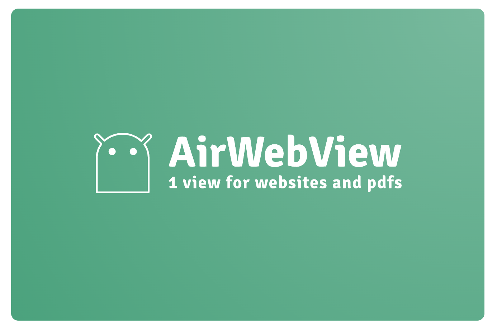

# AirWebView

[](https://jitpack.io/#mumayank/airwebview)

A wrapper that provides a `composable` (and a `view`) to load a website or a `PDF` from a `URL`.

It uses `Android`'s standard [WebView](https://developer.android.com/reference/android/webkit/WebView) to load websites.

And [AndroidPdfViewer](https://github.com/DImuthuUpe/AndroidPdfViewer) library to load `PDF`s.

# Key difference:

- The key difference is in the way a `PDF` is rendered
- Almost all other libraries render `PDF` pages as images, making the `URL`s or links within the `PDF` unclickable.
- This wrapper uses [AndroidPdfViewer](https://github.com/DImuthuUpe/AndroidPdfViewer) which keeps `PDF` links clickable.
- Before rendering, the `PDF` is downloaded from the `URL` in cache memory behind the scene.

## Demo

[Watch the demo YouTube video](https://youtu.be/RugCPfDioWk)

## Possible downsides

Including the library in your app can increase the `APK` size significantly (~16MB). If you use split `APK` or `aab` (which are anyway the default for a few years now), then the issue is already mitigated. [source](https://github.com/DImuthuUpe/AndroidPdfViewer)

## Usage

Project-level `build.gradle`:

```gradle
allprojects {
    repositories {
        google()
        mavenCentral()
        maven { url 'https://jitpack.io' }  // Add this
    }
}
```

app-level `build.gralde`:

```gradle
dependencies {
    implementation 'com.github.mumayank:airwebview:+' // Add this
}
```

project-level `gradle.properties`:

```gradle
android.useAndroidX=true
android.enableJetifier=true
```

Latest version:

[](https://jitpack.io/#mumayank/airwebview)

### Compose-based

```kotlin
AirWebView(
    Modifier.fillMaxSize(),
    url,
    onProgressChange = {
        // Use 'it' to handle progress change
    },
    onError = {
        // Handle error scenario
    },
    setCustomWebView = {
        // optional
        // provide a WebView with your configurations (remember to handle progress changes and errors. refer to this library's way of handling them for reference)
    },
    setCustomPdfView = {
        // optional
        // provide a PDFView with your configurations (remember to handle progress changes and errors. refer to this library's way of handling them for reference)
    }
)
```

### View-based

layout xml:

```xml
<com.mumayank.airwebview.AirWebView
    android:id="@+id/airWebView"
    android:layout_width="match_parent"
    android:layout_height="match_parent" />
```

fragment:

```kotlin
airWebView.load(
    context,
    viewModelScope,
    url,
    onProgressChange = {
        // Use 'it' to handle progress change
    },
    onError = {
        // Handle error scenario
    },
    setCustomWebView = {
        // optional
        // provide a WebView with your configurations (remember to handle progress changes and errors. refer to this library's way of handling them for reference)
    },
    setCustomPdfView = {
        // optional
        // provide a PDFView with your configurations (remember to handle progress changes and errors. refer to this library's way of handling them for reference)
    }
)
```

## Motivation

Challenges in rendering/ loading PDFs with other solutions:

### WebView

- Using Android's WebView to display websites is straightforward, but it cannot natively render
  PDFs.
- WebView is built for web content, not document processing, and lacks built-in PDF support.
- A common workaround involves using a Google Drive URL prefix to render PDFs through Google’s
  services.

- Limitations of this approach:
    - PDFs won't render if the user has exhausted the anonymous preview limit, which is undisclosed
      by Google.
    - File size limits: PDFs over 25MB won’t display.
    - PDFs won’t render if the user is not logged in.

- Additional challenges:
    - No control over UI/UX.
    - This method is not future-proof, as Google can remove access at any time.
    - There is no guarantee of consistent service availability.

- [source1](https://support.google.com/drive/thread/167256653?hl=en&msgid=167271626)
- [source2](https://stackoverflow.com/a/10225157)
- [source3](https://mcbltd.atlassian.net/browse/OM-8599?focusedCommentId=2913245)

### Chrome custom tabs

- Custom Tabs are a feature in Android browsers that give app developers a way to add a customized
  browser experience directly within their app.

- Limitations:
    - cannot render PDFs, this too is dependant on the Google Driver URL prefix trick mentioned
      above
    - depends on the assumption that a modern browser is installed on the user’s device
    - if the user is not logged in via a google account on the installed chrome app, the PDF doesn’t
      load even via the Google Drive URL prefix trick
    - redirect URLs do not load out of the box, requiring manual intervention

- [source](https://developer.chrome.com/docs/android/custom-tabs/guide-get-started)

### PdfRenderer

- Android’s native PdfRenderer (API 21+) allows direct rendering of PDF pages into bitmaps.

- Limitations:
    - The class isn’t thread-safe, requiring manual efforts to safely use it
    - URLs within the pages are not clickable since the pages are rendered as static images.

    - [AirPdf](https://github.com/mumayank/AirPdf)
        - I had created an OS library hosted on GitHub in 2023 to utilize PdfRenderer solution out
          of the box.
        - But it also inherits the same issue: URLs are not clickable because pages are rendered as
          bitmaps.

    - Android 15
        - Android 15 introduced upgrades to PdfRenderer, adding support for password-protected PDFs,
          annotations, and form editing. However, these features are only available on Android 15+
          currently, making them inaccessible for most devices currently with our users. Clickable
          URLs remain unsupported, limiting the interactivity of the rendered PDFs.

### Popular 3rd party libs

- [PSPDFKit](https://pspdfkit.com/pdf-sdk/android)
    - Limitations:
        - incurs costs
        - difficult to customize

- [Barteksc/AndroidPdfViewer](https://github.com/barteksc/AndroidPdfViewerV1)
    - increases app size by around 16MB
    - you cannot open PDF directly using URL. You must download the PDF first, then supply the lib
      that. This requires additional efforts by the developer.
    - no active development in this library
 


## Shoutout

Huge thanks to [AndroidPdfViewer](https://github.com/DImuthuUpe/AndroidPdfViewer) library for making it super easy to render PDFs.

## Keywords

Android WebView library
PDF viewer Android library
Android WebView PDF support
Render clickable PDF links
Load PDF from URL Android
Android PDF rendering solution
Best WebView library for Android
Web content rendering Android
Android PDF viewer with links
Load website in WebView Android
Android WebView alternative
Android PDF viewer library
PDF viewer for Android apps
Android PDF renderer with URL support
WebView and PDF library for Android
Android WebView open-source
Open-source PDF viewer Android
Best PDF rendering library for Android
Lightweight PDF viewer Android
Android library load PDFs
Customizable WebView Android
Android PDF view composable
Best PDF viewer library for Android
PDF rendering Android app
Display PDFs in Android WebView
Render PDF with clickable links Android
Android PDF support with clickable URLs
PDF rendering in Android apps
Android PDF WebView alternative
Best PDF loader Android library
Load websites in Android apps
Android PDF link support
Android PDF viewer with URL links
PDF rendering for Android developers
Android WebView wrapper
Android PDF viewer composable
Open-source WebView solution
Android WebView best practices
PDF loading library for Android
Load website with WebView Android
WebView wrapper Android
Android WebView code examples
Display PDFs in Android apps
Android library for website loading
WebView alternative Android solution
Load website in Android
Android PDF viewer open source
Android WebView GitHub library
Android WebView tutorial
WebView PDF support in Android
Android WebView wrapper solution
Android WebView performance
PDF viewer with interactive links Android
Android WebView enhancements
Display website Android app
WebView example for Android
Android WebView URL handling
Android WebView rendering PDFs
Load URL in Android app
Android library for PDF viewing
Android PDF viewer with caching
PDF download and view Android
Android WebView optimizations
Handle PDFs in Android app
WebView library for Android apps
Android WebView features
Android PDF renderer with caching
Android WebView best library
Android PDF viewer GitHub
Interactive PDF viewer Android
Android WebView link support
Android PDF renderer open source
WebView for Android developers
Best Android library for WebView
Android WebView integration
Best Android WebView open source
PDF viewer Android Jetpack Compose
Android WebView and PDF integration
Android PDF WebView hybrid
Android WebView full screen
Android PDF viewer best practices
WebView Android GitHub
Android WebView split APK
Handle PDF loading in Android
WebView library Android app
Android PDF viewer 2024
PDF viewer Jetpack Compose
Android WebView custom PDF view
Best PDF viewer library Android 2024
Android PDF viewer AndroidPdfViewer
WebView optimizations Android app
Android WebView open source solutions
Android PDF viewer size optimization
Android WebView GitHub library
PDF handling library Android app
Best Android library for PDF viewing
Android PDF URL integration
Android WebView caching
PDF renderer Android development
Android WebView custom integration


